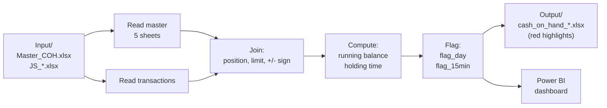

# Cash on Hand (COH) — Cash-Handling Compliance Report

A Python data pipeline that detects **cash-handling policy violations** from point-of-sale
transaction logs and produces a highlighted Excel report for auditors, backed by a Power BI dashboard.

For each employee, the pipeline reconstructs the running cash balance throughout the day,
measures how long cash is held above the allowed limit, and flags two kinds of violations:
end-of-day balances that were never cleared, and cash held over the limit for too long.

> **Data note:** the files under `Input/` are **synthetic mock data** created for demonstration.
> No real employee or transaction data is included in this repository.

---

## Why this project

Manual review of thousands of daily cash transactions is slow and error-prone. This tool
automates the audit: it ingests raw transaction exports, applies the business rules once,
and surfaces only the rows an auditor actually needs to look at — turning a full-day manual
task into a ~30-second run.

---

## What it does

| Step | Description |
|------|-------------|
| **Ingest** | Reads a 5-sheet master workbook (employees, position limits, transaction types) and per-branch transaction files |
| **Join** | Enriches every transaction with the employee's position, cash limit, and transaction sign (+/−) |
| **Compute** | Builds a per-employee, per-day running balance (`AccAmt`) and the time cash is held (`CalculatedTimeSeconds`) |
| **Flag** | Marks rule violations (see below) |
| **Report** | Exports an Excel file with violations highlighted in red, and archives the source file |

### Violation flags

| Flag | Condition | Business meaning |
|------|-----------|------------------|
| `flag_day` | Last transaction of the day, but the running balance ≠ 0 | Employee ended the day still holding cash |
| `flag_15min` | Balance stayed **over the limit** continuously for **≥ ~16 minutes** | Cash held above the ceiling for too long |

Two employee populations are handled separately: **Lumpini** (sheet `JS_889`) and **standard**
(sheet `JS_All`), each with its own limit tables.

---

## Pipeline



---

## Tech stack

- **Python 3.12** — `pandas`, `numpy`, `openpyxl`
- **Power BI** — reporting layer on top of the Excel output
- Auto-computed paths (no hard-coding) via `scrip/util/config_util.py`

---

## Project structure

```
Cash_on_hand/
├── Input/                     Mock source data (master + transactions)
│   └── back_up/               Source files auto-archived after each run  (git-ignored)
├── Output/                    Generated reports: cash_on_hand_*.xlsx
├── scrip/                     Source code
│   ├── coh_pipeline.py        ◄ main entry point (run this)
│   ├── COH.py                 legacy version, kept for reference
│   ├── main.py                legacy launcher
│   └── util/                  config / logging / file helpers
├── logs/                      Run logs, latest 12 kept                   (git-ignored)
├── WORKFLOW.md                Detailed step-by-step internals (Thai)
└── README.md
```

---

## How to run

```powershell
# 1. Install dependencies
pip install pandas numpy openpyxl

# 2. Make sure JS_*.xlsx files are present in Input/
#    (after a run they are moved to Input/back_up/ — move them back to re-run)

# 3. Run the pipeline
cd scrip
python coh_pipeline.py
```

Paths are derived automatically from the project folder. To override them, edit the
`OVERRIDE` section in `scrip/util/config_util.py`.

---

## Notes

- `coh_pipeline.py` reproduces the legacy `COH.py` results exactly, but is cleaner,
  fully commented, and resolves pandas `FutureWarning`s.
- Holding-time and 15-minute-flag calculations run row-by-row, so a large file
  (~38,000 rows) takes roughly half a minute — correct, with room to vectorize later.
- If the master workbook is missing a sheet or a column is renamed, the run stops
  with a log message naming the cause.

---

## Detailed documentation

Full internal logic — column-by-column transformations, join keys, and calculation
order — is documented in **[WORKFLOW.md](WORKFLOW.md)**.
